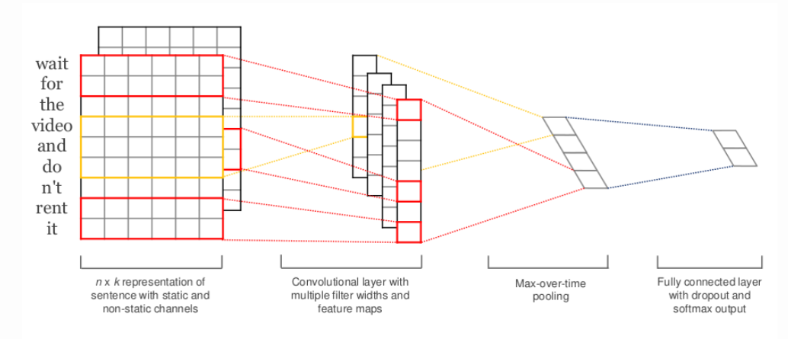

##Textcnn短弹幕发垃圾分类模型
### part 1. 项目背景
#### 1.1问题背景
- 正常弹幕
```
PK号需要的滴我.
50077你卖我
看看五雷咒的威力
```
- 垃圾弹幕
```
溥+C名看P，是威哦，刺激哦
安 KMD555 买-P-微
在线网址换的加
```
- 针对直播间中存在的大量涉黄涉暴弹幕，进行垃圾分类，将弹幕中不合法的内容进行清除.
#### 1.2论文背景知识
[论文地址](https://arxiv.org/abs/1408.5882)


- 相比于一般CNN中的卷积核，这里的卷积核的宽度一般需要和字向量的维度一样，图上的维度是6 。卷积核的高度则是一个超参数可以设置，比如设置为2、3等如图。然后剩下的就是正常的卷积过程了。原论文中只用了一层卷积层，为了提取更多的特征，此处增加了卷积核的尺寸个数，使用多尺寸卷积核提取特征，如下图所示：


## part 2. 文件介绍
```
./checkpoint/  存放训练完的模型文件，模型会自动保存
```

```
./docs/ 存放一些README.md中的图示以及环境配置文件
```

```
./data/cnews 存放训练集文本、验证集文本、测试集文本
```

```
cnews_loader.py 数据加载、预处理、分字字典的创建
```

## part 3. 训练自己的数据
- 配置环境
```
pip install -r ./docs/requirements.txt
```

- 训练
```
$ python run_cnn.py train
```

- 测试评估
```
$ python run_cnn.py test
```
## part 4. 超参调节
```
embedding_dim
```
- 16维：利用训练数据直接自己拟合embedding层，在同一批训练验证集下可以达到较高的召回以及准确率，但是明显存在过拟合的现象。线上测试召回率极高，但是大批量的正常样本被误判为负样本。
- 100维：基于4000w的弹幕语料训练的embedding字向量，模型训练阶段并不能达到最好的召回率以及准确率。线上测试过程中召回率比直接拟合稍低，但是正常样本的误判率也很低。模型泛化能力较强。
```
seq_length
```
- 弹幕文本属于短文本序列，此处的长度不宜过长，50的长度对于此模型来说是比较好的超参。
```
kernel_size
```
- 在单尺寸卷积核的情况下，kernel_size=9可以达到最好的效果
- 在多尺寸卷积核的情况下，kernel_size=[5,7,9]可以达到最好的效果


## part 5. 参考代码
[Text Classification with CNN and RNN](https://github.com/gaussic/text-classification-cnn-rnn)
